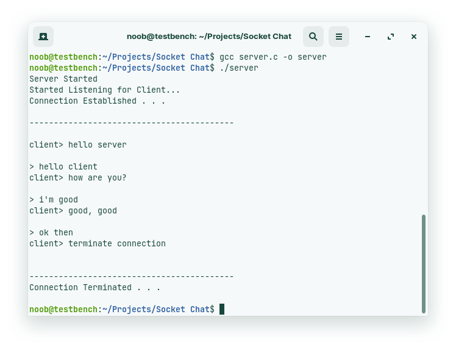
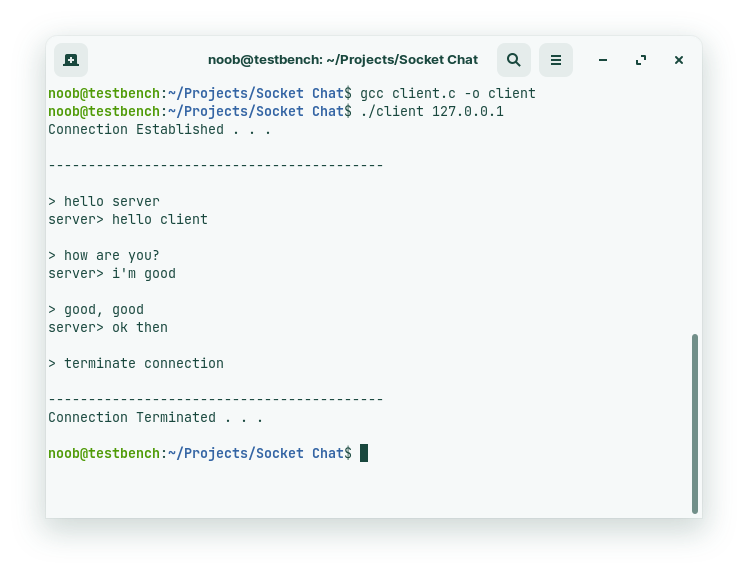

# Server Chat Application

A chat application using socket programming.

## Screenshots





## Usage

1. Open a terminal and create an executable for server by running
    ```
    gcc server.c -o server
    ```
2. Run the server using
    ```
    ./server
    ```
3. Open another terminal and create an executable for client by running
    ```
    gcc client.c -o client
    ```
4. Run the client using
    ```
    ./client 127.0.0.1
    ```
5. The connection will now be established and both can chat
6. The connection can closed using a message starting with `terminate connection`

---
